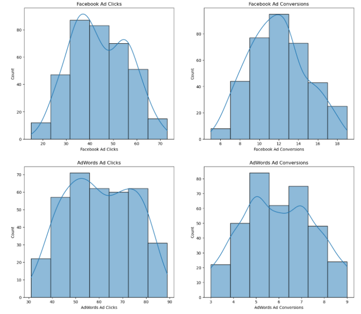
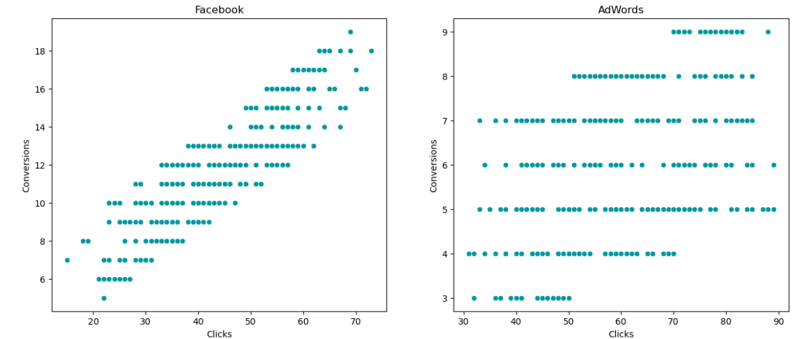
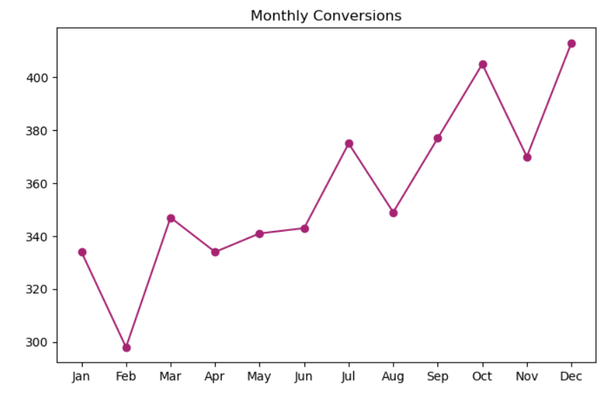
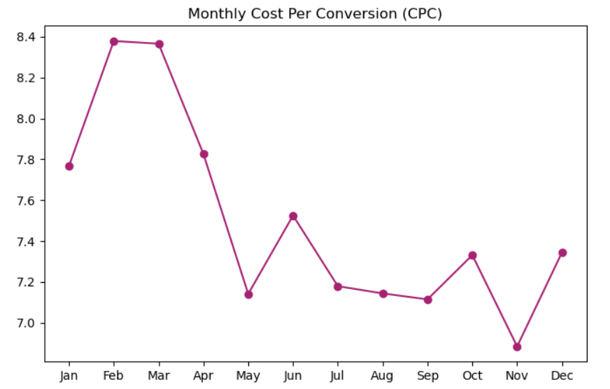

# Marketing Campaign Performance Analysis

## 📌 Project Overview

This project analyses and compares the performance of **Facebook and AdWords advertising campaigns** over 2019.

The analysis evaluates campaign performance across views, clicks, conversions, click-through rate, conversion rate, and advertising costs to identify the more effective platform and derive actionable marketing insights.

## 🎯 Business Objective

Determine which advertising platform delivers better performance in terms of **clicks, conversions, and overall cost-effectiveness**, and identify factors that can help improve campaign efficiency.

## 📁 Dataset

The dataset contains **365 daily observations** covering the period from January 1, 2019 to December 31, 2019.

Key variables include:

* Ad views
* Ad clicks
* Ad conversions
* Advertising cost
* Click-through rate (CTR)
* Conversion rate
* Cost per click (CPC)

## 🛠️ Tools & Technologies

* Python
* Pandas
* NumPy
* Matplotlib
* Seaborn
* SciPy
* Scikit-learn
* Statsmodels
* Jupyter Notebook

## 🔍 Analysis Performed

* Data cleaning and preprocessing
* Data type conversion
* Descriptive statistics
* Facebook vs AdWords campaign comparison
* Conversion and click analysis
* Correlation analysis
* Hypothesis testing
* Linear regression
* Conversion prediction
* Time-series analysis
* Seasonal decomposition
* Cointegration analysis
* Cost-effectiveness analysis

## 📊 Campaign Performance

The analysis compares Facebook and AdWords across key marketing KPIs including views, clicks, conversions, and cost.

## 📈 Clicks and Conversions

The relationship between advertising clicks and conversions was analysed to understand whether higher click volumes are associated with improved conversion performance.

## 📅 Campaign Performance Over Time

Daily campaign data was analysed to identify trends and changes in advertising performance throughout 2019.

## 💰 Cost Effectiveness

Campaign costs and conversion performance were analysed to evaluate the relative efficiency of the two advertising platforms.

## 📊 Key Findings

* Facebook generated a higher average number of daily conversions than AdWords.
* Facebook averaged approximately **11.74 daily conversions**, compared with approximately **5.98 for AdWords**.
* AdWords generated a higher average number of daily clicks, while Facebook generated more conversions.
* The analysis examined the relationship between clicks and conversions using correlation and regression techniques.
* A linear regression model was used to estimate expected Facebook conversions at different click volumes.
* For example, the model estimated approximately **13 conversions for 50 clicks** and **19.31 conversions for 80 clicks**.
* Time-series analysis was used to examine campaign behaviour over the year.

## 📈 Statistical & Predictive Analysis

The project combines descriptive, inferential, predictive, and time-series techniques.

### Statistical Analysis

* Correlation analysis
* Hypothesis testing

### Predictive Analysis

* Linear regression
* R² evaluation
* Conversion prediction

### Time-Series Analysis

* Trend analysis
* Seasonal decomposition
* Cointegration analysis

## 💡 Business Insight

The analysis demonstrates why marketing performance should not be evaluated using clicks alone.

Although AdWords generated more daily clicks on average, Facebook generated substantially more daily conversions. This highlights the importance of evaluating campaigns using multiple KPIs such as conversion rate, conversions, cost, and cost per click.

The findings can help marketers make more informed decisions about campaign allocation and optimization.

## 📂 Files

* `Marketing_Campaign_Analysis.ipynb` — Complete Python analysis
* `marketing_campaign.csv` — Dataset
* `Images/` — Selected visualizations used in this README

## 👤 Author

**Bharat Reddy**

Data Analytics | Business Analytics | Python | SQL | Power BI
